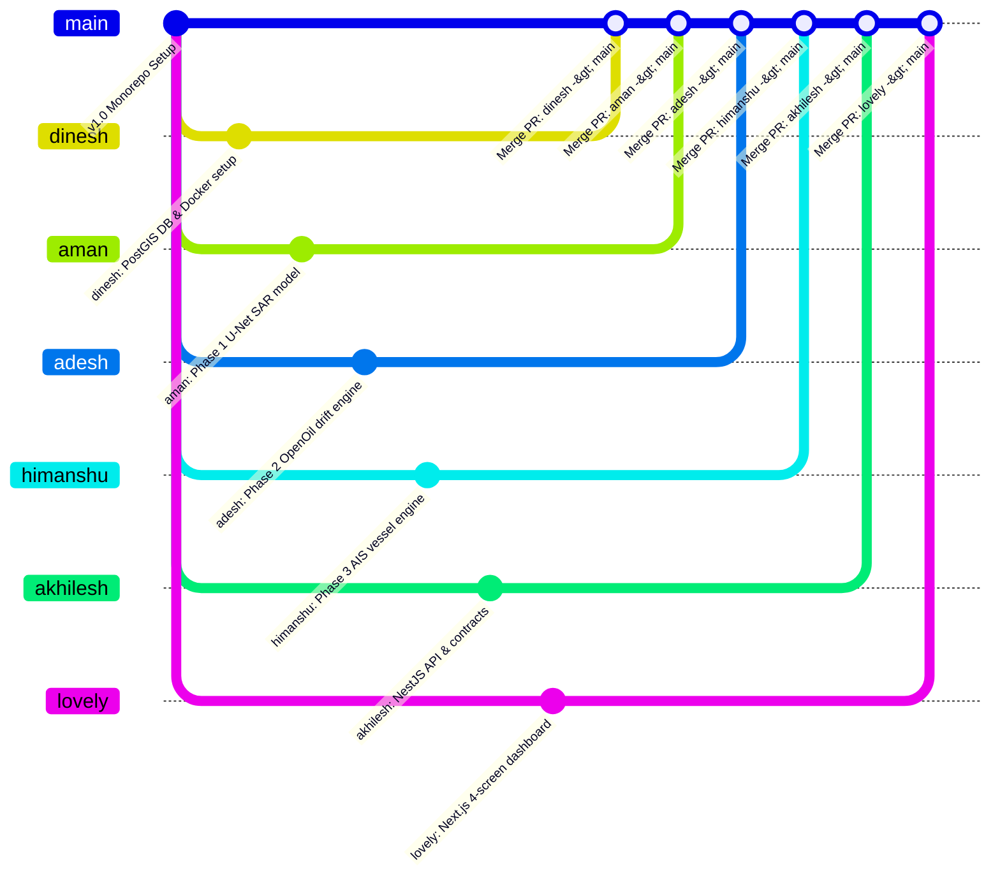

# 🏗️ VARUN-ASTRA System Architecture & GitHub Branch Workflow

> **Smart India Hackathon (SIH-26143)**: Autonomous Marine Oil Spill Detection, Hydrodynamic Drift Forecasting & AIS Vessel Attribution Platform.

---

## 🌿 GitHub Branching & Collaboration Diagram

The repository uses a **Feature-Branch Workflow** where each team member develops on their named branch and merges into `main` via Pull Requests (PRs).



---

## 🔄 GitHub Push & Pull Interaction Flow

```
                                  ==============================
                                    GitHub Remote Repository
                                    (origin/main - STABLE)
                                  ==============================
                                                │
         ┌──────────────────┬───────────────────┼───────────────────┬──────────────────┐
         │ Pull & PR        │ Pull & PR         │ Pull & PR         │ Pull & PR        │ Pull & PR
         ▼                  ▼                   ▼                   ▼                  ▼
  ┌──────────────┐   ┌──────────────┐    ┌──────────────┐    ┌──────────────┐   ┌──────────────┐
  │    lovely    │   │   akhilesh   │    │     aman     │    │    adesh     │   │   himanshu   │
  │ (Next.js UI) │   │ (NestJS API) │    │ (Phase 1 ML) │    │(Phase 2 Drift)│   │ (Phase 3 AIS)│
  └──────────────┘   └──────────────┘    └──────────────┘    └──────────────┘   └──────────────┘
```

---

## ⚡ Git Commands Quick Reference per Developer

### 👩‍💻 1. Lovely (Frontend & Dashboard)
```bash
# Push your work to GitHub
git checkout lovely
git add .
git commit -m "feat(web): add MapLibre trajectory scrubber"
git push origin lovely

# Pull latest team updates from main
git checkout main
git pull origin main
git checkout lovely
git merge main
```

### 👨‍💻 2. Akhilesh (NestJS API Gateway)
```bash
# Push NestJS updates
git checkout akhilesh
git add .
git commit -m "feat(api): add unified dashboard endpoint"
git push origin akhilesh

# Sync with main
git checkout main && git pull origin main && git checkout akhilesh && git merge main
```

### 👨‍💻 3. Aman (Phase 1 SAR & U-Net ML)
```bash
# Push Phase 1 ML updates
git checkout aman
git add .
git commit -m "feat(phase1): export GeoJSON spill polygon & metrics"
git push origin aman

# Sync with main
git checkout main && git pull origin main && git checkout aman && git merge main
```

### 👨‍💻 4. Adesh (Phase 2 OpenOil Drift)
```bash
# Push Phase 2 Drift updates
git checkout adesh
git add .
git commit -m "feat(phase2): generate origin density contours"
git push origin adesh

# Sync with main
git checkout main && git pull origin main && git checkout adesh && git merge main
```

### 👨‍💻 5. Himanshu (Phase 3 AIS Attribution)
```bash
# Push Phase 3 AIS updates
git checkout himanshu
git add .
git commit -m "feat(phase3): calculate candidate score breakdown"
git push origin himanshu

# Sync with main
git checkout main && git pull origin main && git checkout himanshu && git merge main
```

### 👨‍💻 6. Dinesh (PostGIS DB & Docker)
```bash
# Push DB migrations
git checkout dinesh
git add .
git commit -m "feat(db): add spatial PostGIS GIST indexes"
git push origin dinesh

# Sync with main
git checkout main && git pull origin main && git checkout dinesh && git merge main
```

---

## 📂 Monorepo Architecture & Directory Mapping

```
VARUN-SIH26143/
├── apps/
│   ├── web/                    <-- LOVELY (Branch: lovely) | Next.js 16, MapLibre GL, Tailwind
│   └── api/                    <-- AKHILESH (Branch: akhilesh) | NestJS REST API Gateway
├── services/
│   ├── detection-engine/       <-- AMAN (Branch: aman) | Phase 1 SAR FastAPI Engine
│   ├── drift-engine/           <-- ADESH (Branch: adesh) | Phase 2 OpenOil Drift Engine
│   └── ais-engine/             <-- HIMANSHU (Branch: himanshu) | Phase 3 PostGIS Vessel Engine
├── ml/
│   └── phase1/                 <-- AMAN (Branch: aman) | U-Net Training & Sentinel-1 Data Pipeline
├── infrastructure/
│   └── database/               <-- DINESH (Branch: dinesh) | PostGIS Migrations & DB Schemas
├── packages/
│   └── contracts/              <-- AKHILESH & LOVELY | Shared TypeScript API Schemas
└── docker-compose.yml          <-- DINESH | Database & Service Containers
```

---

## 📐 End-to-End Technical Data Flow

```
1. Satellite Image Acquired ──► Phase 1 (U-Net SAR Detection - Aman)
                                        │ (Spill Polygon & Centroid)
                                        ▼
                                Phase 2 (OpenOil Physics Drift - Adesh)
                                        │ (Origin Density & Particle Tracks)
                                        ▼
                                Phase 3 (PostGIS AIS Vessel Attribution - Himanshu)
                                        │ (Top-3 Anonymized Candidates)
                                        ▼
                                PostgreSQL / PostGIS Database (Dinesh)
                                        │
                                        ▼
                                NestJS REST API Gateway (Akhilesh)
                                        │ GET /api/v1/cases/:caseId/dashboard
                                        ▼
                                Next.js 16 + MapLibre Web Dashboard (Lovely)
```
