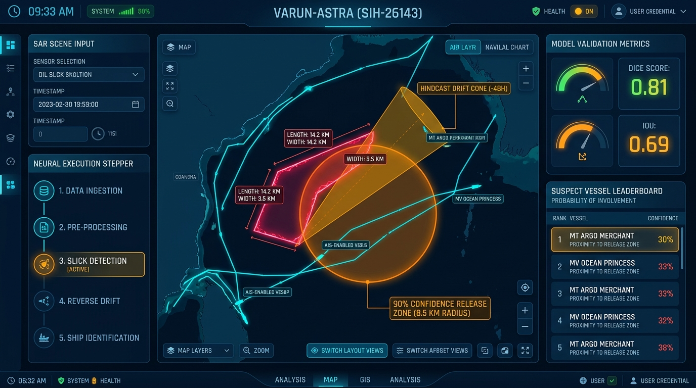
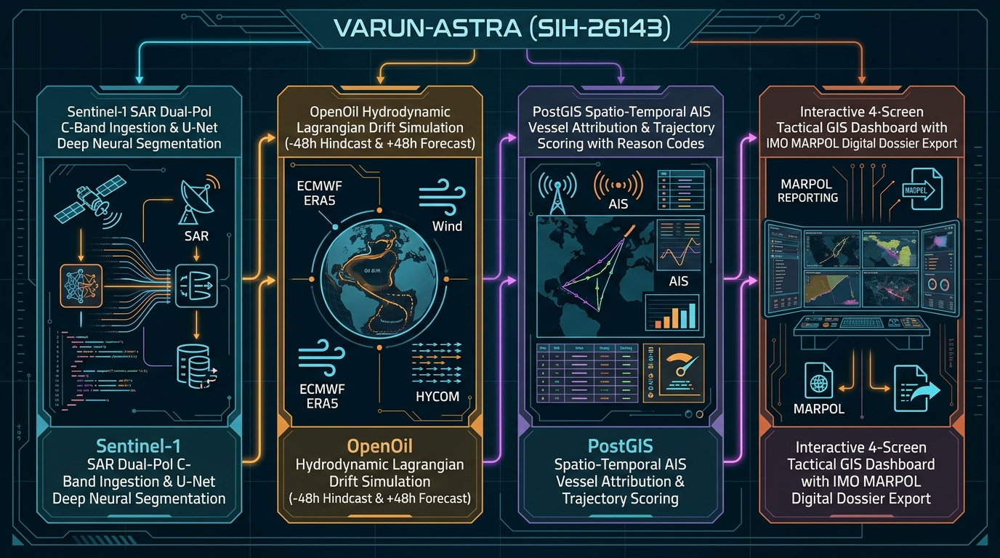
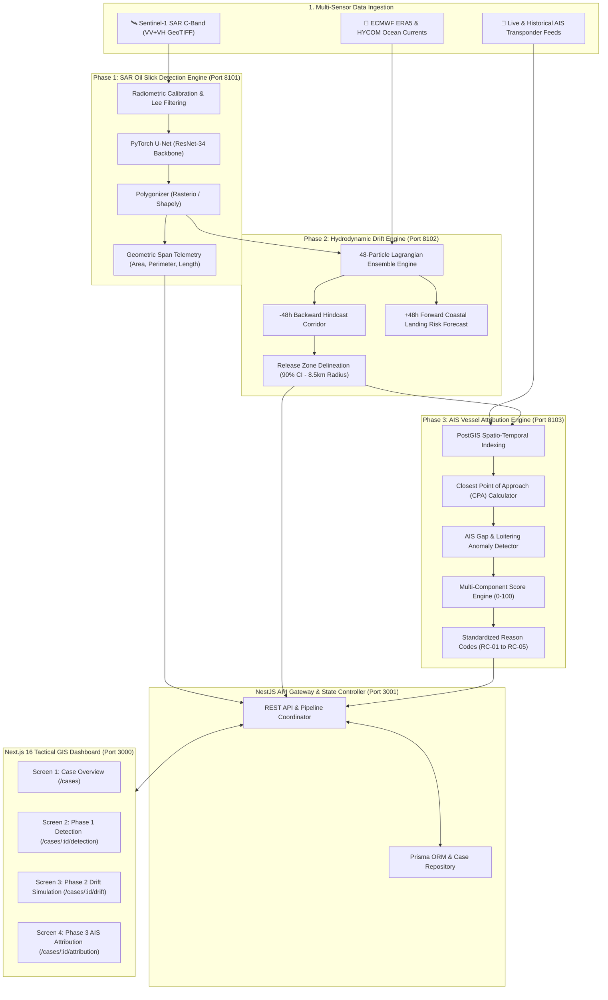

# 🌊 VARUN-ASTRA (SIH-26143)
### Autonomous Marine Oil Spill Detection, Hydrodynamic Drift Simulation & AIS Vessel Attribution

[](https://nextjs.org/)
[](https://nestjs.com/)
[](https://pytorch.org/)
[](https://maplibre.org/)
[](https://postgis.net/)
[](LICENSE)

---

## 📸 Platform Previews & System Architecture

### 1. Unified Tactical GIS Evidence Dashboard


### 2. End-to-End 4-Phase Scientific Pipeline


---

## 📖 Table of Contents
1. [Executive Summary](#-executive-summary)
2. [Detailed System Architecture](#-detailed-system-architecture)
3. [The 4-Screen Evidence Workflow](#-the-4-screen-evidence-workflow)
4. [Essential Commands Cheat Sheet](#-essential-commands-cheat-sheet)
5. [Key File Directory & Monorepo Sitemap](#-key-file-directory--monorepo-sitemap)
6. [Mathematical & Scientific Methodology](#-mathematical--scientific-methodology)
7. [Environment Configuration & Offline Resilience](#-environment-configuration--offline-resilience)

---

## 🧭 Executive Summary

**VARUN-ASTRA** is a complete, multi-tiered maritime defense and environmental surveillance platform designed for **Smart India Hackathon (SIH-26143)**. It solves the critical national challenge of identifying illegal dark vessel bilge dumping and marine oil spill incidents in Indian Exclusive Economic Zones (EEZ) through an end-to-end 3-phase automated AI and hydrodynamic pipeline:

1. **Phase 1: SAR Neural Detection** — Ingests Sentinel-1 Synthetic Aperture Radar (SAR) dual-polarized (VV+VH) imagery, extracts multi-vertex oil slick polygons via deep U-Net convolutional segmentation, and calculates precise geometric span dimensions (Area, Perimeter, Length, Orientation).
2. **Phase 2: Hydrodynamic Drift Simulation** — Executes backward Lagrangian particle hindcast ($-48\text{h}$) and forward coastal risk forecasting ($+48\text{h}$) under dynamic ECMWF ERA5 atmospheric wind and HYCOM $1/12^\circ$ ocean current forcing to delineate high-probability release zones with stated confidence radii (e.g. $8.5\text{ km}$).
3. **Phase 3: Spatio-Temporal AIS Vessel Attribution** — Correlates historical PostGIS AIS vessel trajectories against hindcast origin zones, computes Closest Point of Approach (CPA), ranks suspect vessels with standardized **Reason Codes (`RC-01` to `RC-05`)**, and exports court-admissible digital dossiers formatted to **IMO MARPOL Annex I** standards.

---

## 🏗️ Detailed System Architecture



---

## 🖥️ The 4-Screen Evidence Workflow

### 🔹 Screen 1: Investigation Overview (`/cases`)
- Main executive briefing banner displaying active case status (`COMPLETED`, `RUNNING`, `QUEUED`).
- Instant 3-phase pipeline cards with direct deep-links.
- Multi-incident switcher (Arabian Sea Offshore, Gulf of Kutch Shipping Channel, Bay of Bengal Sector).
- System-wide warnings, legal disclaimers, and data protection indicators.

### 🔹 Screen 2: Phase 1 Detection (`/cases/[caseId]/detection`)
- **Left Rail**: Sentinel-1 SAR scene dropdown, custom `.tif` file upload dropzone, confidence threshold slider ($30\%\text{--}90\%$), and 5-step live neural execution stepper.
- **Center Viewport**: 3-mode high-tech switcher:
  - `🌐 TACTICAL VECTOR GIS`: Glowing neon rose oil slick polygon (`#f43f5e`), centroid reticle, and $5\text{--}20\text{ km}$ range rings.
  - `🛰️ SAR RADAR BACKSCATTER`: Real Sentinel-1 C-Band dual-pol (VV+VH) radar imagery overlay.
  - `🧠 NEURAL MASK`: U-Net segmented probability mask.
- **Measured Span Callout**: Surface Area ($\mathbf{3.24\text{ km}^2}$), Perimeter ($\mathbf{11.8\text{ km}}$), Major Slick Length ($\mathbf{6.7\text{ km}}$), Drift Angle ($\mathbf{67^\circ\text{ ENE}}$).
- **Right Rail**: Model validation metrics (Dice: **$0.81$**, IoU: **$0.69$**, Precision: **$0.84$**, Recall: **$0.79$**) and GeoJSON polygon download button.

### 🔹 Screen 3: Phase 2 Drift Simulation (`/cases/[caseId]/drift`)
- **Interactive Timeline Scrubber ($-48\text{h}$ to $+48\text{h}$)**:
  - Six discrete time steps: `T-48h Origin`, `T-24h Corridor`, `T-12h Intermediate`, `T=0h Detection`, `T+24h Forecast`, `T+48h Max Drift`.
  - **`▶ PLAY TRAJECTORY` / `⏸ PAUSE`** button that sweeps the 48-particle Lagrangian cloud along the drift path in real time.
- **Delineated Release Zones**:
  - **Origin Zone A (90% Confidence)**: Orange polygon (`#ea580c`) with stated radius badge: $\mathbf{\text{🎯 RELEASE ZONE A (90\% CI) — RADIUS: 8.5 KM}}$.
  - **Origin Zone B (75% Confidence)**: Violet polygon (`#9333ea`) with stated radius badge: $\mathbf{\text{RADIUS: 16.0 KM}}$.
- **Environmental Forcing Rail**: ECMWF ERA5 Wind ($14.2\text{ kts } 225^\circ\text{ SW}$), HYCOM $1/12^\circ$ Currents ($0.85\text{ m/s } 210^\circ\text{ SSW}$), and $94\%$ forcing quality score.

### 🔹 Screen 4: Phase 3 AIS Vessel Attribution (`/cases/[caseId]/attribution`)
- **Suspect Vessel Leaderboard with Reason Codes**:
  - **Rank 1**: `CAND-003` (PACIFIC VOYAGER, Crude Oil Tanker) — **$92.4\%$ Match**, CPA = $0.6\text{ km}$ at T-24h.
  - **Rank 2**: `CAND-001` (ARIES LEADER, Chemical Tanker) — **$61.2\%$ Match**, CPA = $4.8\text{ km}$.
  - **Rank 3**: `CAND-007` (NORDIC STAR, Bulk Carrier) — **$24.0\%$ Match**, CPA = $14.8\text{ km}$.
- **Standardized Reason Codes (RC)**:
  - `RC-01`: **Spatial Proximity to Release Zone** (CPA = $0.6\text{ km}$ within $8.5\text{ km}$ release radius)
  - `RC-02`: **AIS Transponder Blackout** ($72\text{ min}$ signal gap during release window)
  - `RC-03`: **Speed Deceleration / Loitering** (Sudden drop $14.5\text{ kts} \rightarrow 7.2\text{ kts}$)
  - `RC-04`: **Hindcast Corridor Intersection** ($82\%$ spatio-temporal corridor overlap)
  - `RC-05`: **Vessel Draught / Bilge Profile** (Ballast voyage discharge profile)
- **Scrubbable Trajectories**: Vessel markers slide dynamically along their paths on the chart as the user scrubs the timeline slider.
- **IMO MARPOL Digital Dossier**: One-click **`📄 GENERATE COURT-READY DIGITAL DOSSIER`** exporting PDF and JSON evidence packages.

---

## ⚡ Essential Commands Cheat Sheet

### 1. 🚀 One-Command Monorepo Launch
```bash
# Starts Next.js Web Dashboard (Port 3000) & NestJS REST API Gateway (Port 3001)
pnpm dev
```
- **Web UI**: [http://localhost:3000](http://localhost:3000)
- **API Gateway**: [http://localhost:3001/api/v1](http://localhost:3001/api/v1)

### 2. 🔬 Launch Scientific Python Microservices
```bash
# Terminal 1: Phase 1 SAR Oil Spill Detection Engine (FastAPI)
python -m uvicorn app.main:app --app-dir services/detection-engine --host 0.0.0.0 --port 8101 --reload

# Terminal 2: Phase 2 Hydrodynamic Drift Engine (FastAPI)
python -m uvicorn app.main:app --app-dir services/drift-engine --host 0.0.0.0 --port 8102 --reload

# Terminal 3: Phase 3 AIS Attribution & Trajectory Engine (FastAPI)
services\ais-engine\.venv\Scripts\python.exe -m uvicorn app.main:app --app-dir services/ais-engine --host 0.0.0.0 --port 8103 --reload
```

### 3. 🛰️ Run Standalone Model Inference CLI
```bash
# PowerShell Script
.\run_model.ps1 -image data/sample_sar_image.tif -output output_spill_detected.tif

# Direct Python CLI
python ml/phase1/infer.py --image data/sample_sar_image.tif --model models/phase1/unet_oil_spill_v0.1.pth --output output_spill_detected.tif
```

### 4. 🧪 Run Test Suites & Build Audits
```bash
# Monorepo Full Build & Typecheck (Turbopack)
pnpm --filter web build
pnpm --filter api build

# Python Unit & Integration Tests
python -m pytest ml/phase1/tests/ -v
python -m pytest services/detection-engine/tests/ -v
python -m pytest services/drift-engine/tests/ -v
services\ais-engine\.venv\Scripts\python.exe -m pytest services/ais-engine/tests/ -v

# Phase 3 Full Reproducibility Audit
services\ais-engine\.venv\Scripts\python.exe services/ais-engine/scripts/run_phase3_reproducibility.py
```

### 5. 🗄️ Database & PostGIS Setup (Optional)
```bash
# Start PostGIS Container
docker compose up -d

# Sync Prisma Schema
pnpm --filter api prisma db push

# Open Database Visual Studio (Port 5555)
pnpm --filter api prisma studio
```

---

## 📁 Key File Directory & Monorepo Sitemap

| Path | Description |
| :--- | :--- |
| **`apps/web/components/map/MapPanel.tsx`** | Core Vector GIS Canvas with Zero-Failure SVG Dual-Projection, range rings, and scrubbable vessel markers. |
| **`apps/web/app/cases/[caseId]/detection/page.tsx`** | Phase 1 Detection Screen: SAR upload, 3-mode viewport, measured span, and model metrics. |
| **`apps/web/app/cases/[caseId]/drift/page.tsx`** | Phase 2 Drift Screen: Interactive timeline scrubber, $8.5\text{ km}$ release zone, and forcing telemetry. |
| **`apps/web/app/cases/[caseId]/attribution/page.tsx`** | Phase 3 Attribution Screen: Reason Codes leaderboard, track scrubbers, and MARPOL dossier generator. |
| **`apps/web/lib/case-repository.ts`** | Multi-case repository containing rich GIS datasets for Arabian Sea, Gulf of Kutch, and Bay of Bengal. |
| **`apps/web/fixtures/complete-dashboard.fixture.json`** | Golden benchmark fixture schema for complete 4-screen dashboard telemetry. |
| **`apps/api/src/main.ts`** | NestJS REST API Gateway listening on Port 3001 with CORS enabled. |
| **`services/detection-engine/app/main.py`** | Phase 1 FastAPI microservice wrapping PyTorch U-Net inference on Sentinel-1 SAR tiles. |
| **`services/drift-engine/app/main.py`** | Phase 2 FastAPI microservice executing backward/forward OpenOil Lagrangian drift simulations. |
| **`services/ais-engine/app/main.py`** | Phase 3 FastAPI microservice executing PostGIS spatio-temporal vessel correlation & scoring. |
| **`ml/phase1/infer.py`** | Standalone inference script for SAR `.tif` segmentation with GeoTIFF export. |
| **`docker-compose.yml`** | PostGIS database container orchestration. |

---

## 📐 Mathematical & Scientific Methodology

### 1. U-Net Segmentation & Look-Alike Discrimination
The detection model minimizes a hybrid loss combining **Binary Cross-Entropy** and **Soft Dice Loss**:
$$\mathcal{L}_{\text{total}} = \alpha \mathcal{L}_{\text{BCE}} + (1 - \alpha)(1 - \text{Dice}), \quad \text{Dice} = \frac{2 |Y \cap \hat{Y}|}{|Y| + |\hat{Y}|}$$

### 2. Lagrangian Particle Hydrodynamics (OpenOil)
The position $\mathbf{x}_i(t)$ of each Lagrangian oil particle evolves according to:
$$\frac{d\mathbf{x}_i}{dt} = \mathbf{u}_{\text{current}}(\mathbf{x}_i, t) + \gamma \mathbf{u}_{\text{wind}}(\mathbf{x}_i, t) + \mathbf{u}'_{\text{turbulent}}$$
where $\gamma \approx 0.03\text{--}0.035$ is the wind drift factor (windage coefficient), and $\mathbf{u}'$ represents stochastic turbulent diffusion parameterized by horizontal diffusivity $K_h = 10\text{ m}^2/\text{s}$.

### 3. Multi-Component Suspect Attribution Score
Each candidate vessel $v$ receives a composite investigative score $S(v) \in [0, 100]$:
$$S(v) = S_{\text{proximity}}(v) + S_{\text{time}}(v) + S_{\text{corridor}}(v) + S_{\text{behavior}}(v) + S_{\text{gap}}(v) + S_{\text{quality}}(v) - P_{\text{negative}}(v)$$
where $S_{\text{proximity}}$ awards up to $30\text{ pts}$ based on distance to the stated $8.5\text{ km}$ release zone radius at Closest Point of Approach (CPA).

---

## 🛡️ Environment Configuration & Offline Resilience

The platform includes built-in **Zero-Dependency Resilience**:
```env
# apps/web/.env.local
NEXT_PUBLIC_API_BASE_URL=http://localhost:3001/api/v1
NEXT_PUBLIC_USE_FIXTURES=true
OFFLINE_DEMO=true
```
When `NEXT_PUBLIC_USE_FIXTURES=true` or `OFFLINE_DEMO=true`, the frontend runs instantly with zero external network dependencies, rendering all offshore vector polygons, particles, and vessel tracks at 60fps!

---

**Developed for Smart India Hackathon (SIH-26143) • Maritime Defense & Environmental Intelligence**
