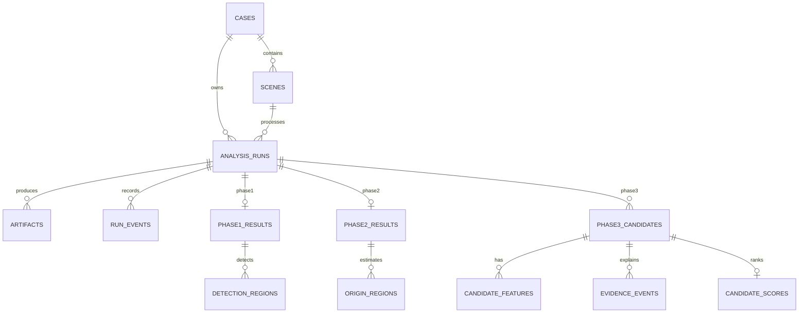

# SIH26143 database design v1

## 1. Technology boundary

- PostgreSQL 16 is the transactional database.
- PostGIS stores/query spatial points, tracks, polygons and bounds.
- Prisma handles ordinary CRUD, relations and transactions.
- Parameterized `pg` SQL handles PostGIS-heavy queries and bulk ingestion.
- pg-boss owns its internal queue tables; `job_executions` is only the domain-facing audit/status mirror.
- GeoTIFF, NetCDF, Parquet, model weights and large JSON frame collections stay in file/object storage. `artifacts` stores their URI, checksum, media type, size, bounds, time extent and provenance.
- All timestamps are `timestamptz` and must enter APIs as ISO-8601 UTC.
- Public vessel endpoints use `candidate_id`; MMSI exists only in `restricted_vessel_identities`.

## 2. Identity and immutable lineage

```text
case -> scene -> analysis_run -> phase-specific result -> artifact/layer/timeline
```

- `case_id`: one investigation.
- `scene_id`: one SAR/EO observation inside the case.
- `analysis_run_id`: one immutable attempt for Phase 1, 2 or 3.
- A retry creates a new run with `retry_of_run_id`; it never overwrites scientific evidence.
- `input_contract_version`, `config_hash`, `code_version`, `started_at` and `finished_at` make a run reproducible.

## 3. Synthetic-data policy

Every relevant case, scene, dataset and run has `data_origin`:

- `REAL`: obtained from a documented real provider/source.
- `SYNTHETIC`: generated for a controlled scenario.
- `MIXED`: real traffic/environment plus injected synthetic target/evidence.

Use synthetic data in these places:

1. Tiny contract/unit fixtures for invalid coordinates, UTC, CRS and geometry.
2. Phase 1 pipeline sanity fixtures; do not present them as external model accuracy.
3. Phase 2 known-origin particle cases for hindcast/reconstruction validation.
4. Phase 3 controlled AIS cases with a known release vessel and distractors.
5. Offline warning/failure replays.

`scenario_ground_truth` is restricted evaluation data. Production feature/scoring database roles must not receive SELECT permission. Evaluators read it only after a score version is frozen. Real unverified MMSI must never be inserted as a known culprit.

## 4. Core entities

| Table | Purpose |
| --- | --- |
| `cases` | Investigation, region, origin and lifecycle |
| `scenes` | Satellite observation, footprint and acquisition metadata |
| `analysis_runs` | Immutable Phase 1/2/3 execution spine |
| `run_events` | Status history, progress and safe errors |
| `job_executions` | pg-boss job correlation/idempotency mirror |
| `artifacts` | External scientific/dashboard file registry |
| `run_warnings` | Machine-readable limitations and warnings |
| `dashboard_layers` | Map layer manifest records |
| `timeline_frames` | Time-indexed lightweight layer/frame references |
| `handoffs` | Versioned Phase 1->2 or Phase 2->3 canonical JSON snapshots |

## 5. Phase 1 entities

| Table | Purpose |
| --- | --- |
| `model_versions` | Approved model package, preprocessing and threshold versions |
| `phase1_results` | Scene-level detection summary and model linkage |
| `detection_regions` | Oil-likelihood polygons and geometric measurements |
| `phase1_metric_sets` | Frozen benchmark or scene metric availability/context |

`detection_regions.classification` uses wording such as `OIL_LIKELIHOOD`; it is not chemical confirmation. Scene metrics can be `NOT_AVAILABLE` when no ground-truth mask exists.

## 6. Phase 2 entities

| Table | Purpose |
| --- | --- |
| `environmental_datasets` | Current/wind/wave/coast source, units, coverage and checksum |
| `phase2_results` | Observation, release window, search region and evidence mode |
| `drift_scenarios` | Candidate age/forcing/boundary/seed configuration |
| `origin_regions` | 50/75/90 density contours or alternative origin modes |
| `reconstruction_metrics` | Candidate forward-reconstruction metrics |
| `forecast_summaries` | Future-envelope/coastal-contact scenario summary |

Phase 2 stores `origin_evidence_surface`, never a new `origin_probability` field. Density contours are evidence regions, not certainty percentages.

## 7. Phase 3 entities and privacy

| Table | Purpose |
| --- | --- |
| `ais_datasets` | Provider/licence/coverage/version for bounded AIS subsets |
| `ais_ingests` | Raw-to-clean counts and ETL provenance |
| `restricted_vessel_identities` | Restricted source identity/MMSI only |
| `ais_points` | Observed AIS points and quality flags |
| `ais_track_segments` | Observed/interpolated track pieces and coverage |
| `phase3_candidates` | Run-scoped public `candidate_id` |
| `candidate_decisions` | Inclusion/exclusion reason and candidate-set version |
| `candidate_features` | Raw/normalised versioned features with units/status |
| `evidence_events` | Spatial/time/behaviour/negative evidence events |
| `candidate_scores` | Deterministic investigative score, rank and confidence |
| `score_components` | Weight, raw value, contribution, cap/deduction and reason |
| `controlled_scenarios` | Labelled synthetic/verified evaluation scenario metadata |
| `scenario_ground_truth` | Restricted known target/release data, never a scoring input |

Public database views/API DTOs must project `candidate_id` and approved metadata only. They must not expose `identity_id`, MMSI, provider raw identity, raw SQL or local paths.

## 8. Relationship summary



## 9. Spatial type rules

- Scene footprint/search/origin/detection geometries: `geometry(Geometry,4326)` with GiST index.
- AIS point: `geometry(Point,4326)` plus optional generated/query geography usage.
- AIS segment/corridor/track: `geometry(LineString,4326)`.
- Area/perimeter/distance values are persisted in metres/metres squared after projected/geography calculation.
- GeoJSON serialization always returns `[longitude, latitude]`.

## 10. Main indexes

- GiST on all frequently queried geometries.
- B-tree on `(case_id, phase, status)`, observation times and run lineage.
- AIS point composite B-tree on `(identity_id, observed_at)`.
- AIS segment composite B-tree on `(dataset_id, started_at, ended_at)`.
- Unique `(analysis_run_id, candidate_id)` and `(candidate_id, feature_name, feature_version)`.
- Unique artifact logical name/version within a run.
- Partial/idempotency uniqueness on active/request keys in `analysis_runs` and `job_executions`.

## 11. Dashboard read model

The complete-dashboard endpoint should compose lightweight summaries from relational tables and `dashboard_layers`. Heavy particle frames, GeoTIFF, NetCDF and full vessel tracks are loaded from validated artifacts/drill-down endpoints. Do not recompute scientific features during GET requests.

## 12. Implementation order

1. Enable PostGIS and core enums/tables.
2. Apply core indexes and constraints.
3. Add Phase 1 tables and validate Phase 1 handoff fixtures.
4. Add Phase 2 tables and exact `phase2-to-phase3-v1` fixtures.
5. Add restricted AIS identity, AIS storage and privacy roles/views.
6. Add candidates/features/scores and controlled evaluation schema.
7. Add dashboard layers/timeline and complete-dashboard queries.
8. Seed synthetic fixtures, run privacy tests, then ingest any real bounded data.

## 13. Acceptance gates

- A retry cannot overwrite an older run.
- A handoff always names source and target run.
- Every artifact path has checksum, media type and provenance.
- Invalid or missing geometry/time/contract is rejected before job execution.
- Phase 3 public views contain `candidate_id` and zero restricted identity fields.
- Synthetic/mixed/real origin is visible on every judge-facing result.
- Ground-truth tables are inaccessible to scoring roles.
- Spatial queries use indexes and known fixtures return expected results.
- Complete-dashboard values trace to persisted run/evidence/artifact versions.
